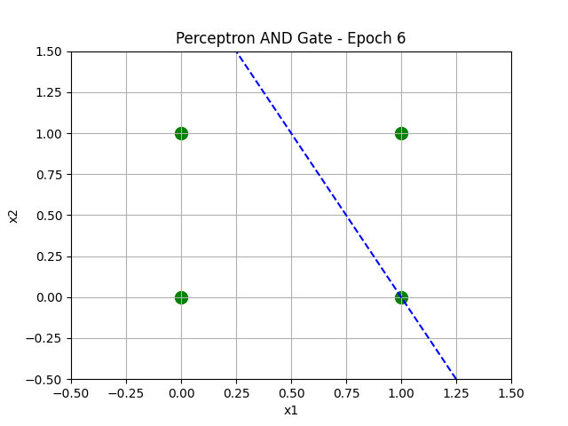
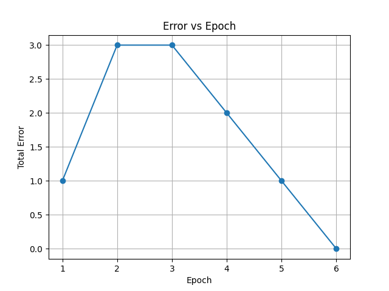

Prompt : CHANDRAKANT BARIK 31/JAN/2026 1:20 AM 

single-layer perceptron for realizing the AND logic gate using NumPy and Matplotlib. wo not equal 0 , w= w1,w2.. plot x= x1+x2------ wn = wo + x w^nx = delta initialize weights with zero point update all till sample classify or misclassify w^tx not equal to 0 delay 500ms. Include a bias term and initialize all weights, including the bias weight, to zero. Train the perceptron using the  given standard weight update rule and repeatedly iterate through the dataset until all input samples are correctly classified. During each  particular  epoch, print all input combinations along with their target output, predicted output, error value, and the updated weights in a clear table format.Print all the input values of datasets and along with expected output vs Output draw visualization and table out the output and graph visually  perceptron python. After every epoch, visually plot the input points and the corresponding decision boundary, clearly differentiating correctly classified and misclassified points using different colors or markers, and introduce a 500-mili second delay to observe how the boundary changes over time. Once the perceptron converges, plot a graph of error versus epoch to illustrate the learning process and convergence behavior.in the code at each iteration provide print where it is misclassifsied or sucess

Epoch 1
--------------------------------------------------------------------------------
x1 x2 | Target | Output | Status        | Error | Updated Weights
--------------------------------------------------------------------------------
0  0  |   0    |   0    | SUCCESS       | +0   | [0. 0. 0.]
0  1  |   0    |   0    | SUCCESS       | +0   | [0. 0. 0.]
1  0  |   0    |   0    | SUCCESS       | +0   | [0. 0. 0.]
1  1  |   1    |   0    | MISCLASSIFIED | +1   | [1. 1. 1.]

Epoch 2
--------------------------------------------------------------------------------
x1 x2 | Target | Output | Status        | Error | Updated Weights
--------------------------------------------------------------------------------
0  0  |   0    |   1    | MISCLASSIFIED | -1   | [0. 1. 1.]
0  1  |   0    |   1    | MISCLASSIFIED | -1   | [-1.  1.  0.]
1  0  |   0    |   0    | SUCCESS       | +0   | [-1.  1.  0.]
1  1  |   1    |   0    | MISCLASSIFIED | +1   | [0. 2. 1.]

Epoch 3
--------------------------------------------------------------------------------
x1 x2 | Target | Output | Status        | Error | Updated Weights
--------------------------------------------------------------------------------
0  0  |   0    |   0    | SUCCESS       | +0   | [0. 2. 1.]
0  1  |   0    |   1    | MISCLASSIFIED | -1   | [-1.  2.  0.]
1  0  |   0    |   1    | MISCLASSIFIED | -1   | [-2.  1.  0.]
1  1  |   1    |   0    | MISCLASSIFIED | +1   | [-1.  2.  1.]

Epoch 4
--------------------------------------------------------------------------------
x1 x2 | Target | Output | Status        | Error | Updated Weights
--------------------------------------------------------------------------------
0  0  |   0    |   0    | SUCCESS       | +0   | [-1.  2.  1.]
0  1  |   0    |   0    | SUCCESS       | +0   | [-1.  2.  1.]
1  0  |   0    |   1    | MISCLASSIFIED | -1   | [-2.  1.  1.]
1  1  |   1    |   0    | MISCLASSIFIED | +1   | [-1.  2.  2.]

Epoch 5
--------------------------------------------------------------------------------
x1 x2 | Target | Output | Status        | Error | Updated Weights
--------------------------------------------------------------------------------
0  0  |   0    |   0    | SUCCESS       | +0   | [-1.  2.  2.]
0  1  |   0    |   1    | MISCLASSIFIED | -1   | [-2.  2.  1.]
1  0  |   0    |   0    | SUCCESS       | +0   | [-2.  2.  1.]
1  1  |   1    |   1    | SUCCESS       | +0   | [-2.  2.  1.]

Epoch 6
--------------------------------------------------------------------------------
x1 x2 | Target | Output | Status        | Error | Updated Weights
--------------------------------------------------------------------------------
0  0  |   0    |   0    | SUCCESS       | +0   | [-2.  2.  1.]
0  1  |   0    |   0    | SUCCESS       | +0   | [-2.  2.  1.]
1  0  |   0    |   0    | SUCCESS       | +0   | [-2.  2.  1.]
1  1  |   1    |   1    | SUCCESS       | +0   | [-2.  2.  1.]

Training completed!
Final weights: [-2.  2.  1.]

